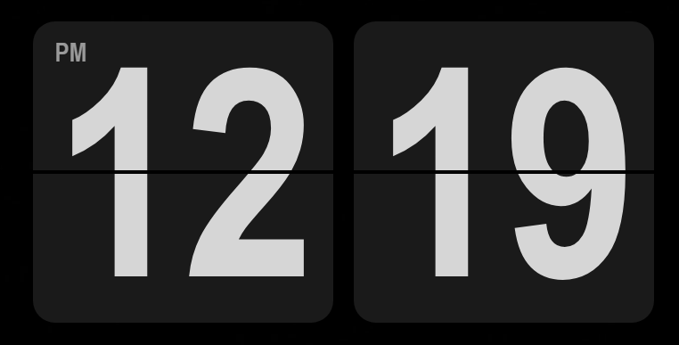

# KadoClock

A minimal Fliqlo-style flip clock widget for Windows, built with Electron.



## Features

- Classic flip clock animation
- Transparent, frameless window — sits cleanly on any desktop
- 12/24-hour display
- Scalable from 50% to 200%
- Drag to reposition; position is remembered across restarts
- Start with Windows option
- Helvetica Neue Condensed Bold font support (if installed or bundled)

## Installation

Download `KadoClock.exe` from the [latest release](../../releases/latest) and run it directly. No installation needed.

> **Note:** Windows SmartScreen may show a warning on first launch since the executable is unsigned. Click **More info** → **Run anyway**.

## Usage

| Action | How |
|---|---|
| Move the clock | Click and drag |
| Open settings | Right-click |
| Toggle 12/24-hour | Right-click → 24-hour clock |
| Resize | Right-click → Size |
| Start with Windows | Right-click → Start with Windows |
| Quit | Right-click → Quit |

## Font

KadoClock uses **Helvetica Neue Condensed Bold** if it is installed on your system. If it isn't, place your font file in the same folder as the executable, named `HelveticaNeue-CondensedBold.ttf` or `HelveticaNeue-CondensedBold.otf`. Falls back to Arial Narrow if neither is found.

## Building from Source

Requires [Node.js](https://nodejs.org) v18 or later.

```bash
git clone https://github.com/yourusername/KadoClock.git
cd KadoClock
npm install
npm start          # run in development
npm run dist       # build KadoClock.exe
```

The built executable will be in the `dist/` folder.

## Memory Usage

KadoClock is optimised to run lean:
- Hardware acceleration is disabled
- GPU runs in-process (no separate GPU process)
- JS heap is capped at 32 MB
- Typical total RAM usage: ~70 MB across all processes
